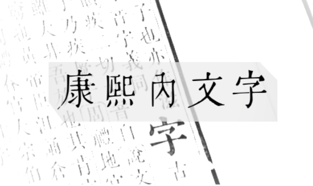
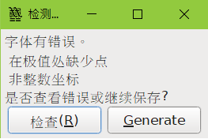

# 康熙内文字

所谓 **康熙内文字** 是指扫描《康熙字典》里的内文字而成的字体，本字体纯粹是扫描字体， **不作任何加工**（如为修复因扫描而出现残缺的部件）。

* 使用工具
    * FontForge（制作字体）
    * Inkscape（自动描边）
    * 《康熙字典》，以1716年内府本的[《康熙字典》](https://www.shuge.org/ebook/kang-xi-zi-dian/) 为底本

* 大致做法

## 收字

本字体的收字范围以中华人民共和国教育部制定的《识字、写字教学基本字表》（2011版）作参考对象，全表共三百字。

除了这三百字以外，也增加表中简化字对应的繁体字（以《简化字总表》为准）；另增加作者认为需要的字，如"康熙内文字"中的"康熙内"三字。

**＊本字体并没有收录英文字母、数字及标点符号，如有需要请自行配搭其他字体。**

### 收字一览

共355字

>一　七　万　三　上　下　不　业　个　中　主　九　也　乾　了　二　云　五　些　交　京　亮　人　什　今　从　他　以　份　你　伴　但　住　作　來　個　們　做　儿　元　先　光　兒　內　全　兩　八　公　六　共　关　册　再　冬　几　出　刀　分　別　到　前　力　加　動　包　北　医　十　千　午　半　厂　厰　去　又　双　反　口　只　叫　可　台　叶　吃　合　同　后　向　听　吵　和　哥　哭　問　喫　嚮　四　回　因　國　土　在　地　坐　外　多　大　天　太　奇　女　她　好　妹　姐　媽　奶　子　字　孩　學　客　家　對　小　少　就　尺　山　工　己　巾　市　師　干　平　年　幹　幾　广　床　康　廠　廣　开　彆　很　後　從　微　心　快　成　我　手　才　打　找　把　放　文　方　日　早　明　星　春　是　時　晚　更　書　會　月　有　朋　木　本　机　東　林　果　校　样　桌　條　業　樂　樣　樹　機　次　正　歲　每　比　毛　民　气　氣　水　江　没　沒　河　洗　海　火　灯　然　熙　燈　爲　爸　爺　片　牙　牛　狗　猫　王　玩　班　現　瓜　生　用　田　画　畫　當　發　白　百　的　皮　目　直　看　眞　着　瞭　知　石　票　秋　穿　窗　立　站　竹　笑　箇　米　紅　給　經　網　纔　网　羊　美　羽　習　老　耳　聲　聽　胖　臉　自　興　舌　船　花　草　茶　葉　著　萬　虫　蟲　行　衣　衹　被　裏　西　要　見　話　說　語　誰　課　讓　豆　貓　貝　走　起　跑　跳　身　車　軍　軟　辦　農　迎　迴　這　進　過　道　還　邊　那　都　醫　里　金　長　門　開　閤　關　阳　阴　陰　陽　雙　雨　雪　電　靑　面　鞦　韆　音　頁　頭　風　飛　飯　飽　馬　高　髮　魚　鳥　麪　麵　點　鼕　

### 缺字一览

共67字

>东　两　为　乐　书　习　会　们　兴　军　农　别　办　动　卫　发　问　国　声　头　妈　学　对　岁　师　当　时　来　条　树　点　為　爷　现　电　真　睏　红　给　经　脸　裡　见　让　话　语　说　谁　课　贝　车　边　过　还　进　这　长　门　青　页　风　飞　饭　饱　马　鱼　鸟　

这是《识字、写字教学基本字表》（2011版）里有，但《康熙字典》没有收录（有时有字头，但没有内文字，如"声"；或作者看漏）而造成的缺字，主要是简化字。

## 缺点

* 字与字之间的空隙看起来似乎大了些
* 字体有 "在极值处缺少点"、"非整蜈坐标"的错误

* 由于是纯粹扫描，日后字体档案的大小可能会很大

## 版权

 **康熙内文字** 采用[SIL Open Font License 1.1](LICENSE) 授权，可任意使用（商用或自用）或修改（但修改后不能以"康熙内文字"的名字再发布。你可以更改全名，或是在原名加上前缀或后缀，如"康熙内文字改"、"XX风康熙内文字"之类）。

## 下载

[康熙内文字](https://github.com/yencio/KHnuiwen/releases/tag/khnuiwen-v1.0)

## 展望

1. 改善字与字之间空隙大的问题（但很大机会不会改）
2. 能够展示《三字经》、《百家姓》、《千字文》的内文（以《百家姓》为优先）
3. 以现代汉语常用字表的2500字的常用字为目标
